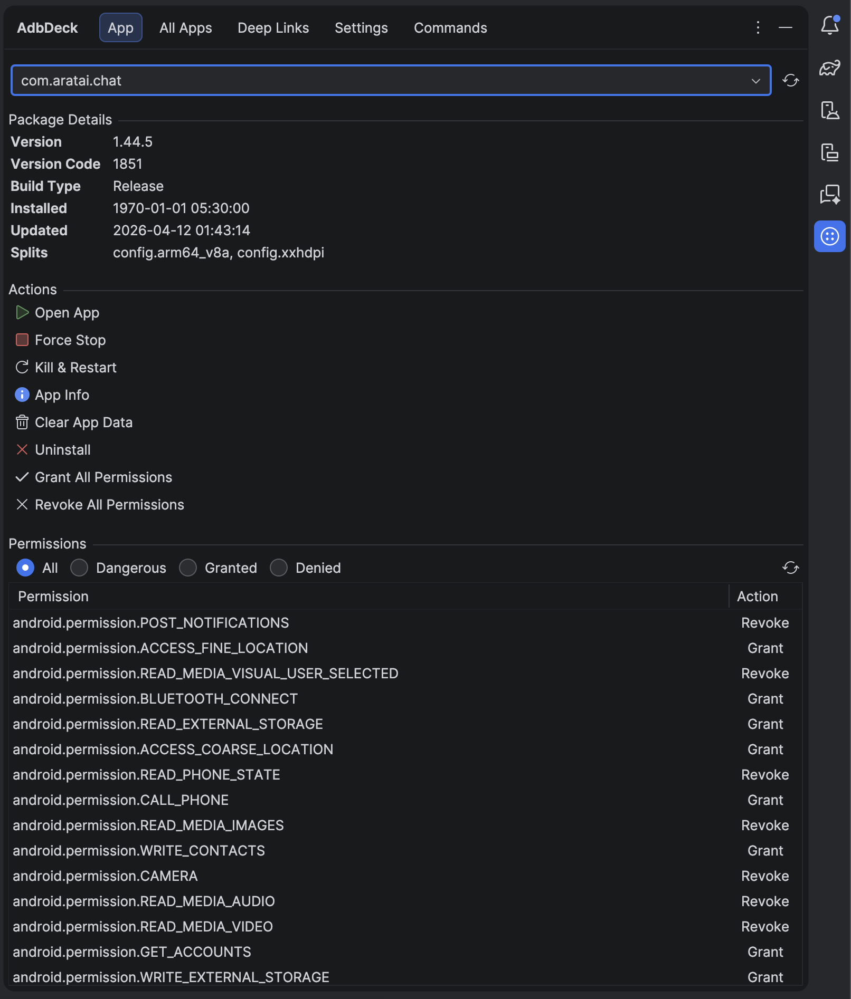
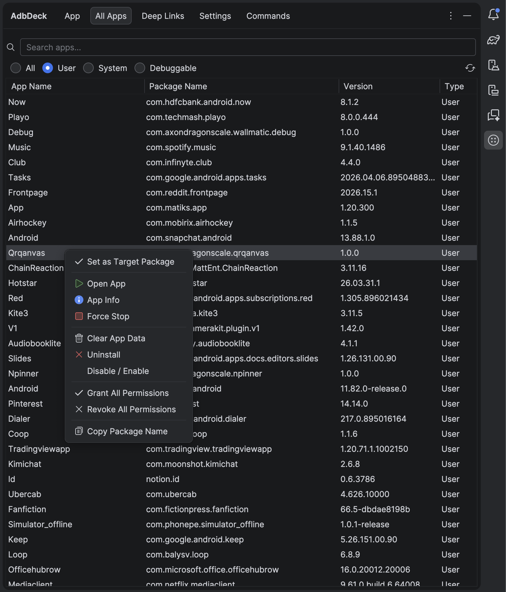
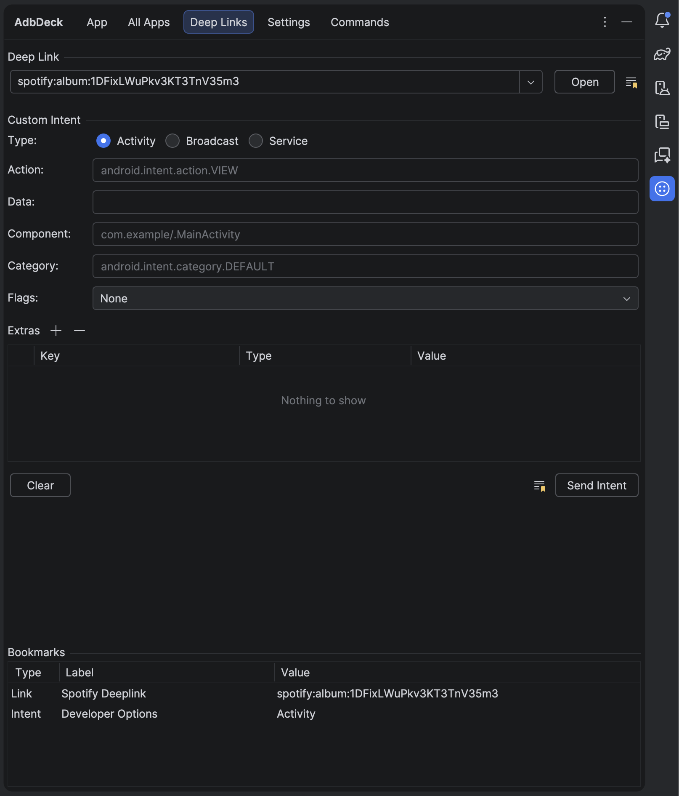
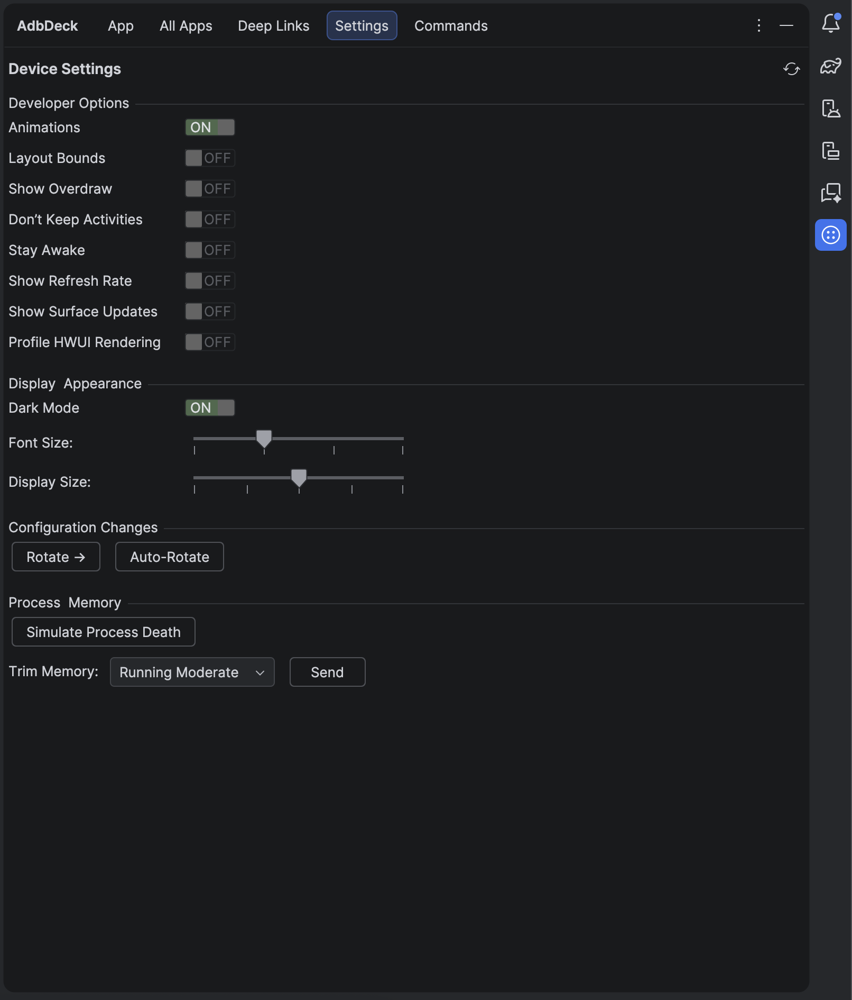
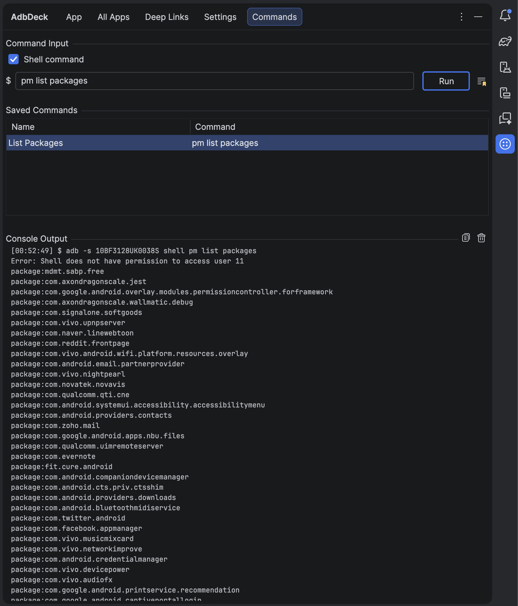

# AdbDeck


> An Android Studio plugin that provides quick access to ADB operations developers actually need — the ones Android Studio doesn't already surface well.

<!-- Plugin description -->
**AdbDeck** is a focused tool window for Android Studio that puts common ADB operations at your fingertips. Stop context-switching to the terminal for toggling developer settings, managing permissions, testing deep links, simulating edge cases, and clearing app data.

### Features

- **App Tab** — Force stop, kill & restart, clear data, uninstall, open app info, and manage runtime permissions with a single click. Includes a package selector that auto-detects your project's `applicationId`.
- **All Apps Tab** — Browse, search, and filter all installed apps on the device. Filter by user, system, or debuggable apps. Right-click for quick actions.
- **Deep Links & Intents Tab** — Launch deep links, build custom intents with extras, and bookmark frequently used URIs and intents.
- **Device Settings Tab** — Toggle animations, layout bounds, dark mode, don't keep activities, stay awake, and more. Adjust font size and display density with sliders.
- **Commands Tab** — Run arbitrary ADB/shell commands with a built-in console. Save and organize frequently used commands. Navigate history with arrow keys.

All actions are also registered as IntelliJ actions, discoverable via **Find Action** (<kbd>Cmd</kbd>+<kbd>Shift</kbd>+<kbd>A</kbd>) by searching "AdbDeck".
<!-- Plugin description end -->

## Screenshots

| App | All Apps | Deep Links |
|-----|----------|------------|
|  |  |  |

| Settings | Commands |
|----------|----------|
|  |  |

## Installation

- **Using the IDE built-in plugin system:**

  <kbd>Settings/Preferences</kbd> > <kbd>Plugins</kbd> > <kbd>Marketplace</kbd> > <kbd>Search for "AdbDeck"</kbd> > <kbd>Install</kbd>

- **Manually:**

  Download the [latest release](https://github.com/AxonDragonScale/AdbDeck/releases/latest) and install it manually using
  <kbd>Settings/Preferences</kbd> > <kbd>Plugins</kbd> > <kbd>⚙️</kbd> > <kbd>Install plugin from disk...</kbd>

## Requirements

- Android Studio Meerkat (2025.3) or newer
- A connected Android device or emulator

## Actions

All actions are available via **Find Action** and can be assigned custom keybindings in <kbd>Settings</kbd> > <kbd>Keymap</kbd> > <kbd>AdbDeck</kbd>.

| Action | Description |
|--------|-------------|
| AdbDeck: Force Stop | Force stop the current app |
| AdbDeck: Clear Data | Clear the current app's data |
| AdbDeck: Kill & Restart | Kill and restart the current app |
| AdbDeck: Open App | Launch the current app |
| AdbDeck: Toggle Animations | Toggle device animations on/off |
| AdbDeck: Simulate Process Death | Kill the app process to test state restoration |

## Building from Source

```bash
./gradlew buildPlugin
```

The plugin ZIP will be in `build/distributions/`.

## License

See [LICENSE](LICENSE) for details.

---

Built by [AxonDragonScale](https://github.com/AxonDragonScale).
